# Agent 流程图（展示用 · 纯 Mermaid）

> 用途：给领导与用户讲解「后端 Agent 做什么、信息怎么流、谁负责什么」。
> **刻意不含任何接口路径、数据库或技术栈细节**：这里只讲职责与信息流向。
> 图例：真实侧＝你是谁；虚构侧＝如果那样，你的生活会怎样。

---

## 图 1 · 总览：两个世界，一个底座

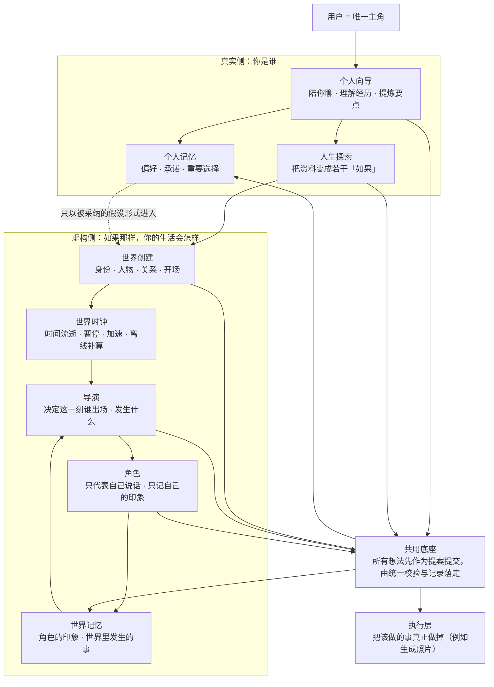

**一句话**：和你聊天的一套人负责「你是谁」；手机世界背后的一套人负责「如果你的选择成真」；两边共用同一个底座，但**私人信息不进入世界**。

---

## 图 2 · 每个 Agent 做什么（职责图）

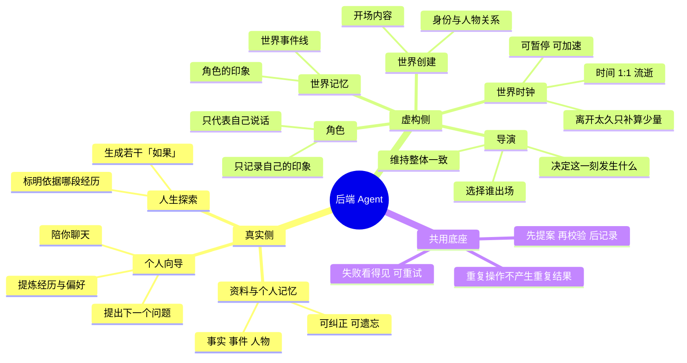

**一句话**：只有「导演」负责全局节奏，其余角色只管自己那一份；没人可以直接改结果。

---

## 图 3 · 信息路径：你的一句话如何变成资料与记忆

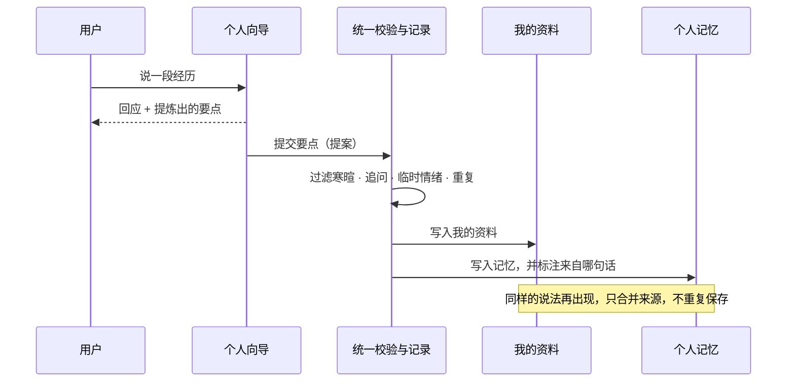

**一句话**：你聊完就沉淀好了，不需要逐条确认；说重复了也不会存两遍。

---

## 图 4 · 从资料到分支，再到一段人生

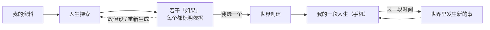

**一句话**：分支来自你的真实经历；选中后才会建立世界。

---

## 图 5 · 你在世界里发消息时，发生了什么

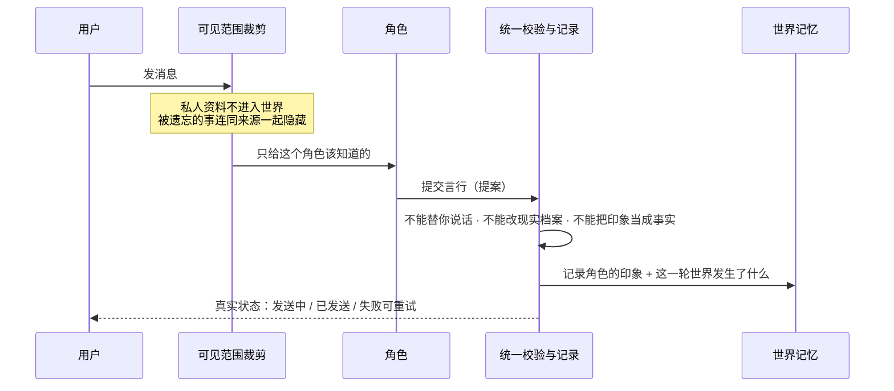

**一句话**：每个角色只知道他该知道的；回复是提案，经过校验才成立；失败绝不伪装成功。

---

## 图 6 · 导演的工作循环（让世界自己会走）

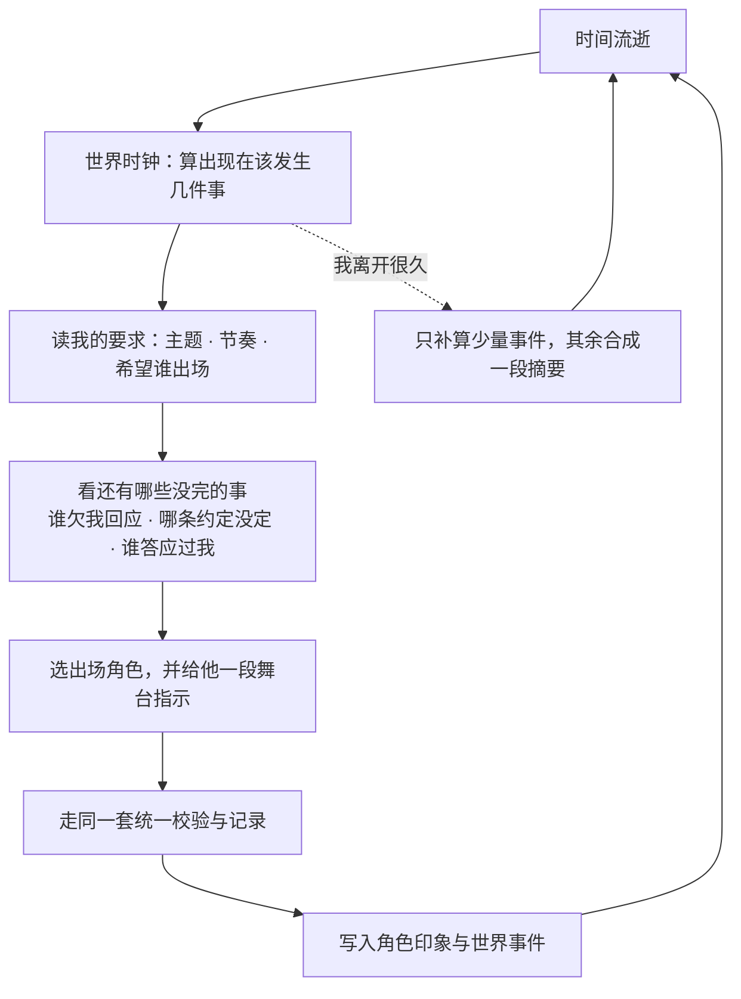

**一句话**：世界围绕「你还没了结的事」运转，而不是随机找人说话；离开再久也不会失控或超支。

---

## 图 7 · 时间：真实、可控、不失控

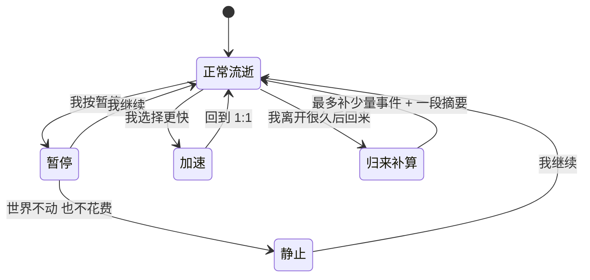

**一句话**：默认与现实 1:1；暂停就是真的停；离开期间的空白用「少量事件 + 一段摘要」交代，而不是无限补算。

---

## 图 8 · 记忆的一生

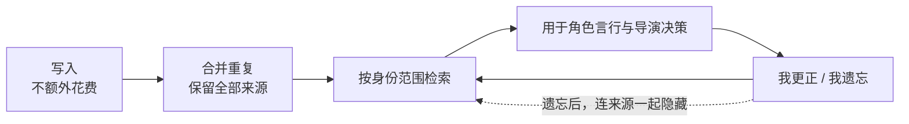

**一句话**：记得住、改得掉、忘得干净。

---

## 图 9 · 隔离：一道只有单向的门

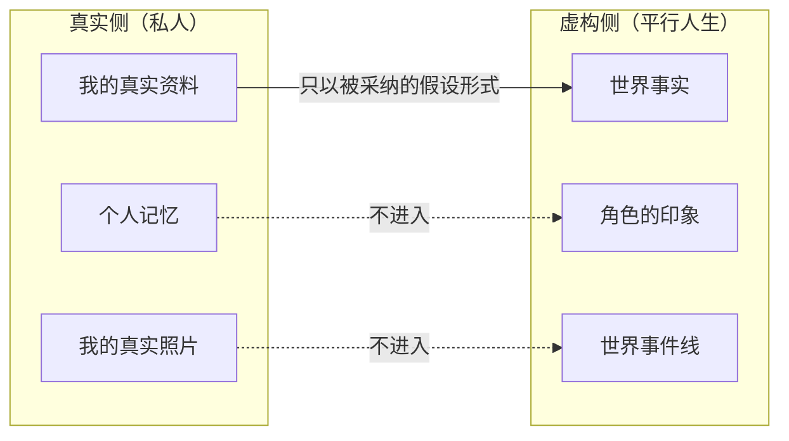

**一句话**：世界只能拿到你授权的假设；真实资料与照片永远留在真实侧。

---

## 图 10 · 你指挥导演

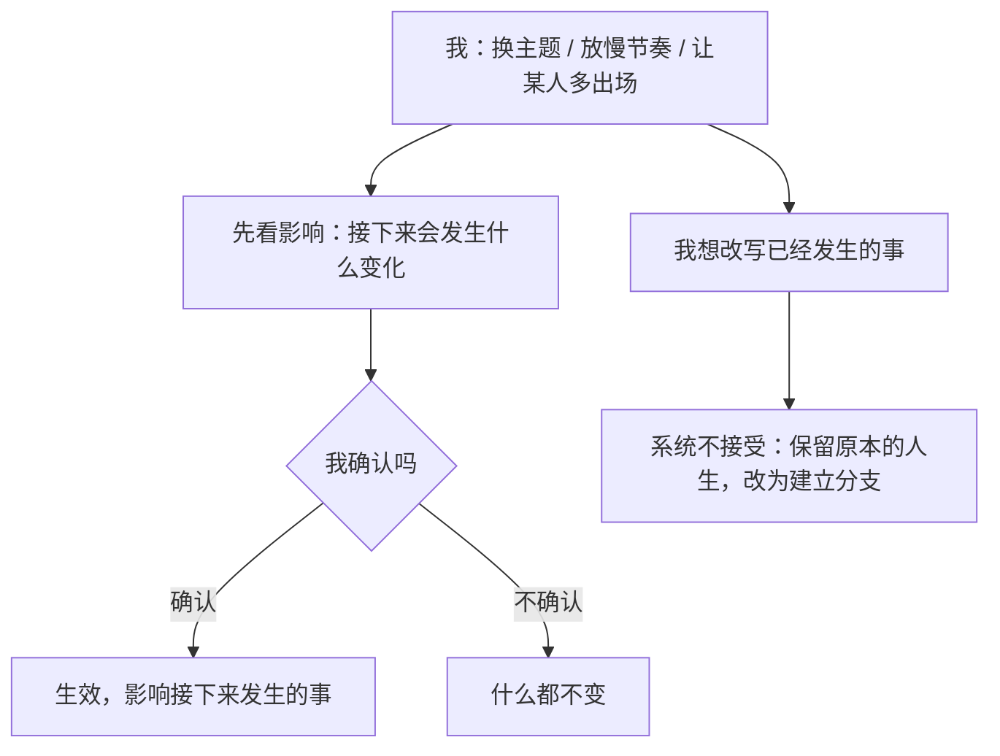

**一句话**：能指挥未来、能先看影响；历史不改写，改写就走分支。

---

## 图 11 · 为什么可以放心（三条底线）

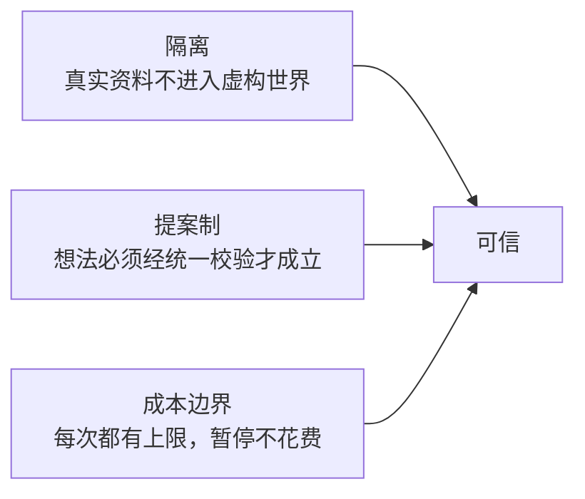

**一句话**：可信不是靠提示词，而是靠结构与边界。
