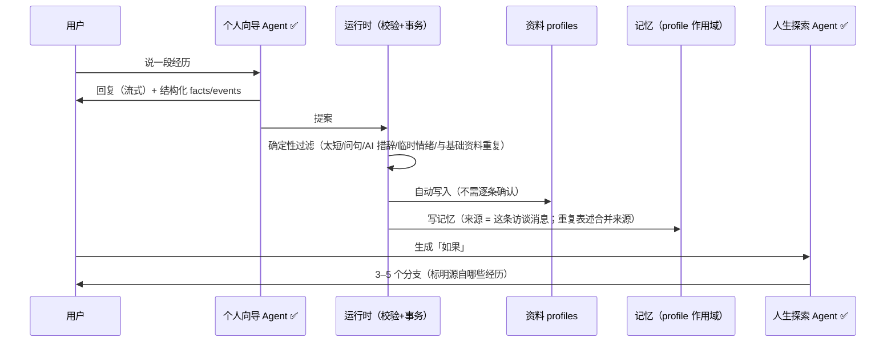
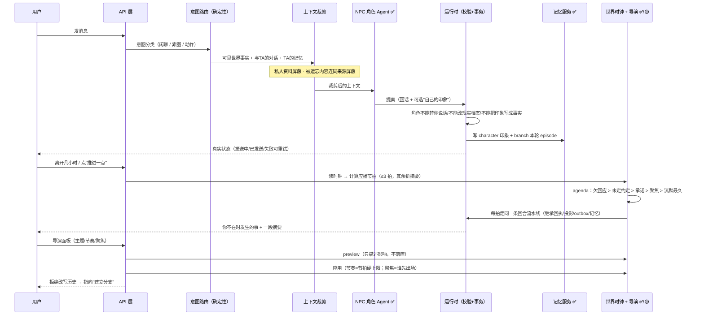

# 预期架构与预期效果（目标态）

> 这份文档描述**我们想要的系统**，不是"现在已经做到的"。
> 现状请对照：[AGENT_FLOW.md](AGENT_FLOW.md)（已实现）与 [DEVELOPMENT.md](DEVELOPMENT.md)（唯一状态表）。
> 图例：**✅ 已实现** · **🟡 本期补齐** · **⬜ 后续阶段**。所有"预期效果"都给出可验收口径（第六节）。

---

## 一、预期效果（用户与领导视角）

**一句话**：用户进入的不是一个"AI 聊天框"，而是一段**会自己继续的人生**——所有人围绕他转，他不在时世界照常运转，回来时能看见发生了什么，并且这一切他有指挥权。

| # | 预期效果 | 用户看到什么 | 验收口径 |
|---|---|---|---|
| 1 | **被围绕** | 每个角色都对他有未了之事：谁欠他回应、谁答应过什么、哪条约定还没定 | 节拍选人优先级：欠回应 > 未定约定 > 承诺 > 聚焦 > 沉默最久 |
| 2 | **世界自己会走** | 离开几小时回来，手机上有新消息、新事件 | 离开 6 小时回来：**最多 3 拍真实事件 + 1 段摘要**，成本 ≤3 次模型调用 |
| 3 | **时间真实可控** | 1:1 流逝，可暂停、可 2×、可"跳到下一件事" | 暂停 = 0 次调用且世界不动；改速度不丢时间也不造时间 |
| 4 | **他是指挥，不是旁观者** | 能给导演提主题、调节奏、点名让谁出场 | `preview` 先看影响再应用；调节奏立即改变每拍次数 |
| 5 | **记忆像人一样** | 角色记得自己的印象，不记得不属于他的事 | 私人资料永不进入世界；被遗忘的内容连同来源一起消失 |
| 6 | **说错能改** | "这条不对"→ 立刻改；"忘掉"→ 立刻不再出现 | 旧记录 superseded；forgotten 不删除但任何检索都拿不到 |
| 7 | **不假装** | 失败看得见、能重试；没接的功能说没接 | 无假成功、无假图、无硬编码"在线"；unknown 永不自动重付 |
| 8 | **能截图给朋友看** | 手机里的消息/相册/日历/朋友圈彼此自洽 | 同一事件在消息、日历、相册里指向同一条事件 |
| 9 | **⬜ 两个真人相遇** | 两人各自的人生，在共同事件里相遇 | 只共享授权的虚构设定与共同场景，不共享私人访谈与照片 |

---

## 二、目标架构总图

```
┌──────────────────────────────────────────────────────────────────────────────┐
│ 用户（唯一主角）· 手机为主 · PC 辅助                                          │
│ 访谈 / 我的资料 / 人生轨迹 / 「如果」分支 / 手机六应用 / 导演面板 / 时间控制     │
└───────────────────────────────┬──────────────────────────────────────────────┘
                                │ 会话 + CSRF
┌───────────────────────────────┴──────────────────────────────────────────────┐
│ API 层（Next.js）                                                             │
│ /session /interview /life-proposals /world-builds                            │
│ /worlds/:id /messages /notes /photos /advance /clock /direction              │
│ /memory/records /outbox/drain /tasks/:id/run                                 │
└───────────────────────────────┬──────────────────────────────────────────────┘
                                │ 只经 src/server 组装（边界强制）
┌───────────────────────────────┴──────────────────────────────────────────────┐
│ 共用运行时：AI 只提案 → 校验 → 事务                                           │
│ 回执 · 事件 · 投影（消息/日历/便签/事实/素材） · 有界快照 · outbox · 记忆       │
│ 幂等（同 commandId 返回原回执）· unknown 不自动重付 · 失败可见可重试            │
└──────┬──────────────────────────────────────────────────────┬────────────────┘
       │                                                      │
┌──────┴──────────────────────┐              ┌────────────────┴────────────────┐
│ 真实侧（私人）               │  授权假设 →  │ 虚构侧（平行人生）               │
│ ✅ 个人向导（提炼+提问）      │  （单向门）  │ ✅ 世界创建（身份/人物/开场）     │
│ ✅ 人生探索（分支提案）       │              │ ✅ 世界时钟（1:1/倍速/暂停/补算） │
│ ✅ 资料（facts/events/people）│              │ ✅ 导演（节拍/选人/舞台指示）     │
│ ✅ profile 记忆              │              │ 🟡 导演控制面（主题/节奏/聚焦）   │
│                              │              │ ✅ NPC 角色（单角色回合）        │
│                              │              │ ✅ 角色认知 memory（character） │
│                              │              │ ✅ 世界事件线 memory（branch）   │
└──────────────────────────────┘              └────────────────┬────────────────┘
                                                               │
                                              ┌────────────────┴────────────────┐
                                              │ 执行层                           │
                                              │ ✅ outbox 消费者 → 任务队列       │
                                              │ 🟡 媒体执行（M-01..M-03）         │
                                              │ ⬜ 共同场景/共享时钟（G-04/G-05） │
                                              └─────────────────────────────────┘
```

**三条不可协商的红线**（架构层面保证，不靠提示词）：
1. **隔离**：真实访谈/照片/档案永不进入世界；世界只拿到被采纳的分支假设。
2. **提案制**：任何 Agent 都不能直接写状态；一切经校验与事务。
3. **成本边界**：每次模型调用都有上限（每拍 ≤1 次、一次推进 ≤3 拍、暂停 0 次、离线只补算+摘要）。

---

## 三、目标态主链路（时序）

### 3.1 真实侧：访谈 → 资料 → 分支



### 3.2 虚构侧：进入分支 → 与 NPC 对话 → 世界自己走 → 用户指挥



---

## 四、导演的目标工作循环（预期核心）

```
        ┌──────────────────────── 现实时间流逝 ────────────────────────┐
        │                                                              │
        ▼                                                              │
  ① 时钟（纯函数）                                                      │
     故事时间 ← 现实时长 × 速度（1:1 默认；可暂停/2×）                    │
     应播节拍 = 时长 / 每拍时长，**上限 3**，其余 → 摘要（不花钱）          │
        │                                                              │
        ▼                                                              │
  ② 读 brief（用户指挥）                                                 │
     主题 / 节奏(slow=1,normal=fast=3) / 聚焦角色                          │
        │                                                              │
        ▼                                                              │
  ③ 建 agenda（未了结的事）                                              │
     欠回应 → 未定约定 → 角色承诺 → 聚焦角色 → 沉默最久                    │
        │                                                              │
        ▼                                                              │
  ④ 选人 + 舞台指示（不冒充用户说话）                                     │
        │                                                              │
        ▼                                                              │
  ⑤ 走同一条回合流水线（校验 → 事务 → 回执/投影/outbox/记忆）              │
        │                                                              │
        ▼                                                              │
  ⑥ 写回：character 印象、branch episode、离线摘要 summary               │
        │                                                              │
        └──────────────────────► 下一拍 / 等待下次推进 ──────────────────┘
```

**预期效果**：用户不在时世界也在动；回来时"有事发生"但**账单有上限**；他给的指示（主题/节奏/聚焦）**真的改变**谁出场、多久推进一次。

---

## 五、记忆模型（目标态）

```
        写入（0 次额外模型调用，挂在已读原文的 Agent 上）
  访谈提炼 ──► profile 记忆 ─┐
  世界回合 ──► character 印象 ├─► 合并去重（同义合并来源）──► memory_records
  世界事件 ──► branch episode ┘                                  + source_refs
  离线摘要 ──► branch summary                                     （真实来源 id）
                                                                      │
                                          检索（按作用域 + 预算 + 遗忘屏蔽）
                                                                      ▼
      ┌───────────────────────────────────────────────────────────────┐
      │ NPC 只需自己该知道的：character(自己) + branch(本世界)          │
      │ 导演需要"未了结的线"：commitment / 约定 / 欠回应                 │
      │ 用户需要"可纠正的记忆"：correct → superseded；forget → 屏蔽来源  │
      └───────────────────────────────────────────────────────────────┘
```

**预期效果**：越聊越"懂他"，但**不会越聊越乱**（不重复沉淀）、**不会知道不该知道的**（隔离）、**说错能改且改得干净**（来源一起屏蔽）。

---

## 六、预期效果的可验收指标

| 主题 | 指标（可测） |
|---|---|
| 被围绕 | 同一角色不会连续两拍出场；有未了结之事时优先由当事人出场 |
| 世界会走 | 6 小时缺勤 → 恰好 ≤3 拍 + 1 段摘要；暂停 → 0 拍且 0 次模型调用 |
| 时间真实 | 故事时间始终追上现实；改速度/暂停不移动也不丢失故事时间 |
| 指挥有效 | 节奏 slow → 每拍 1 次；`preview` 不落库；`move:'past'` 返回 422 且提示建分支 |
| 记忆正确 | 同句重复 → 1 条记录、来源数 +1；`forgotten` 在检索与上下文中都不出现 |
| 隔离 | 真实访谈/照片 id 永远不出现在世界上下文的测试中 |
| 不假装 | 媒体未接入 → 任务如实失败且素材数为 0；未知结果不自动重付 |
| 一致性 | 同一事件在消息/日历/相册三处指向同一 `sourceEventId` |
| ⬜ 多人 | 两人共同场景幂等分发、断线接续；任一方的私人数据在他方不可见 |

---

## 七、与现状的差距（映射到任务 ID）

| 预期能力 | 状态 | 差距 / 任务 |
|---|---|---|
| 访谈 → 资料自动沉淀 | ✅ | — |
| 分支提案 → 建世界 | ✅ | — |
| NPC 回合 / 角色认知 / 检索隔离 | ✅ | — |
| 消息真实状态 / 便签持久化 / 事实容量 | ✅ | — |
| outbox 消费者 + 媒体任务骨架 | ✅ | 真图生成：**M-01 → M-02 → M-03** |
| 世界时钟 + 有界导演 + agenda + 控制面 | ✅ | 完整改写影响对比与"一键建分支"（现为量化预览 + 拒绝改写） |
| **手机端四个界面**（时间控件/导演面板/记忆界面/索图结果） | 🟡 | 方案见 [D-25 报告](task-reports/D-25.md)，只差接线 |
| 上传解码资源限制、生产权限面、内容安全 | 🟡/⬜ | **AUD-16 / AUD-11 / AUD-19**（内容安全需先定策略） |
| 账号跨设备、共同场景、真人相遇 | ⬜ | **G-01 → G-02 → G-03 → G-04 → G-05** |
| 权益与成本硬限额、导出/删除、可访问性 | ⬜ | **E-01..E-03 / R-01 / R-02** |

---

## 八、出图提示词（交给 GPT / 画图工具）

**图 A · 预期体验海报（给领导）**
> 画一张信息图，标题"你进入的不是聊天框，是一段会继续的人生"。中央是一个人的剪影站在手机屏幕前，屏幕里是一个正在运转的小城。围绕他画三类元素：①"谁欠你回应 / 答应过你什么 / 哪条约定没定"的便签围绕他旋转；②一条时间轴标注"1:1 真实时间 / 可暂停 / 2×"；③一个导演椅图标，旁边写"主题 · 节奏 · 聚焦谁"。右下角三个小徽章："不假装 / 有上限 / 数据隔离"。右下角再放一个小注："离开 6 小时回来：最多 3 件事 + 1 段摘要"。

**图 B · 目标架构（分层）**
> 自上而下四层。①"用户 = 唯一主角"（手机+PC，标注：访谈/资料/轨迹/分支/手机应用/导演面板/时间控制）。②"API 层"，列出接口路径。③"共用运行时"粗带，写"AI 只提案 → 校验 → 事务（回执/事件/投影/快照/outbox/记忆）"，右侧竖排三个红标签："隔离 / 提案制 / 成本边界"。④底部左右两框："真实侧（私人）"与"虚构侧（平行人生）"，两框之间只画一扇**单向门**，门牌写"授权假设"；虚构侧下面接"执行层：outbox → 任务 → 媒体/节拍"。每层用不同灰度表示"已实现/本期补齐/后续阶段"。

**图 C · 导演工作循环**
> 画一个六段环形流程（顺时针）：①时钟（1:1/倍速/暂停/离线≤3 拍+摘要）②读用户 brief（主题/节奏/聚焦）③建 agenda（欠回应→未定约定→承诺→聚焦→沉默最久）④选人 + 舞台指示（标注"绝不冒充用户说话"）⑤同一条回合流水线（校验→事务）⑥写回记忆（印象/事件/摘要）→ 回到①。环外标注"成本上限"，环内写"世界自己会走"。

**图 D · 记忆与隔离**
> 左右两个世界，中间一道加锁的墙，墙上只有一扇单向小门，门牌"授权假设"。左边写"真实档案 / profile 记忆 / 真实照片"；右边写"世界事实 / character 印象 / branch 事件线"。墙下写一行大字："真相靠隔离，不靠提示词。"右侧再画一条记忆环线：写入（0 额外调用）→ 合并来源 → 按作用域检索 → 遗忘屏蔽 → 用户纠正/遗忘。
