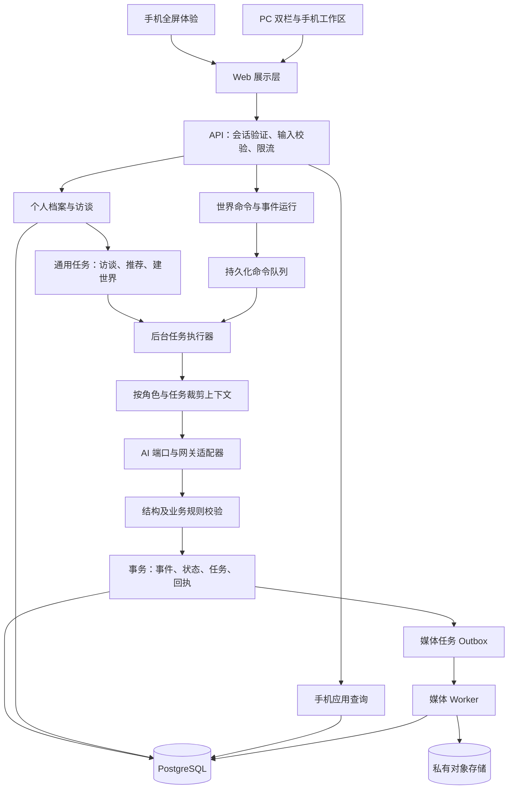
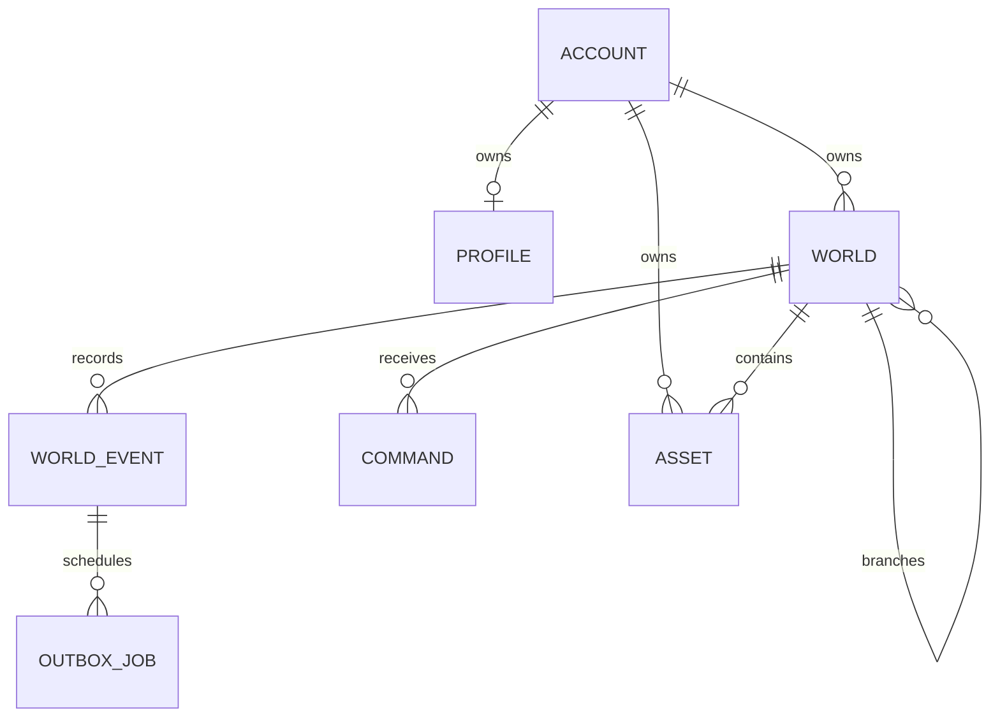
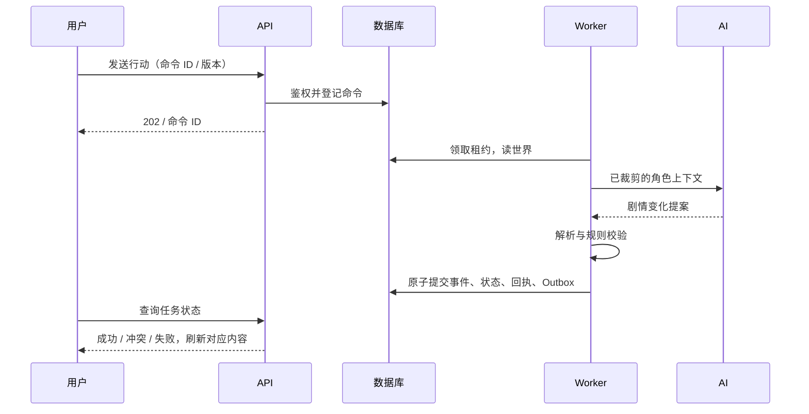

# Parallel Life 架构基线

日期：2026-09-22。状态：已落地领域骨架与基础验证；产品模块逐步实现。本文是后续开发的主入口，需求以 PRODUCT.md 为准，界面以 DESIGN.md 为准。

## 1. 目标、边界与架构选择

用户通过真实对话建立个人档案，从自己的经历生成平行人生，再通过一部虚拟手机持续体验。故事和人物必须由交流产生。产品支持照片、角色聊天、生活应用、导演调整、多人生、时间与真人相遇。

采用 **模块化单体 + 持久化事件 + 异步任务**：Web 和 API 在一个 TypeScript 项目中，业务模块通过应用接口协作，生成任务由独立 worker 进程执行。首版不拆微服务、不引入 Kafka、不让每个角色常驻模型调用。需要更多吞吐时独立扩展 worker，而不重写业务规则。

技术基线：Next.js App Router / React / TypeScript；PostgreSQL 作为持久化真源；私有 S3 兼容对象存储保存照片；yibuapi 服务端适配器提供模型能力。具体数据库和对象存储供应商在部署阶段确定，不复用探索原型的用户数据库。当前只参考该项目的框架版本与网关协议。

## 2. 模块职责与依赖

|模块|负责|不能负责|当前状态|
|---|---|---|---|
|identity|游客/账号、会话、访问主体|剧情和推荐|设计阶段|
|profile|访谈、事实来源、确认状态、个人轨迹|直接修改平行世界|类型已建立|
|discovery|基于档案的可能性推荐、用户采纳|固定剧情池替代个性化|契约部分位于 profile 类型|
|world|世界版本、命令、事件、分支与时间规则|直接发 HTTP 或写组件状态|领域与单角色回合内核已建立|
|cast|人物、独立记忆、关系、知识边界|读取完整现实访谈|人物与上下文过滤暂在 world 内聚|
|director|节奏规划、世界初始化、多人事件提案|直接写数据库、跳过校验|设计阶段|
|phone|消息、朋友圈、相册、日历、便签查询和展示|各应用各自编造世界事实|设计阶段|
|media|生成任务、参考照片、资源权限、复用|自动无限重试收费请求|状态类型已建立|
|ai|模型调用、超时、错误映射、协议适配|决定用户权限或直接改变世界|文本适配器已建立，未真实接通|
|tasks|访谈、推荐、建世界、媒体等任务与租约|要求所有任务已存在 worldId|范围与状态契约已建立；数据库及 Worker 待实现|
|multiplayer|授权设定、共享场景、成员关系|读取参与者私人档案|设计阶段|
|entitlements|时间权益、配额、支付回执|通过浏览器参数授予权益|设计阶段|

目录内分 domain（纯规则）、application（用例和端口）、infrastructure（数据库/网关适配器）。只有 server/composition.ts 组装实现；app 路由负责适配请求。UI 不导入数据库和模型实现，domain 不依赖 React、Next、网络或环境变量。modules/phone 和身份等在实际开发时建立，不提前生成大量空文件。

## 3. 数据模型和信息边界

三种信息独立：现实档案属于用户；平行世界属于该人生；共同场景只持有参与者同意共享的虚构内容。私密性靠服务端访问控制和上下文裁剪保证，不能只靠提示词“不要泄露”。

ProfileFact 记录来源消息、确认状态和修订时间。LifeProposal 记录档案版本与推荐依据。ApprovedWorldSeed 明确用户同意带入的事实和图片，不直接把完整访谈放进每个角色提示词。WorldState 记录当前版本、世界时间、人物、事实、消息、日历和媒体请求。WorldEvent 保存状态变化来源。OutboxJob 与事件绑定，确保已承诺的生成任务不会丢失。

测试骨架以 JSON 对象表示状态；真实存储首版将消息、日历、媒体请求分别存为投影，不把无限增长的聊天数组写进每轮世界快照。紧凑 JSONB 快照保存人物状态、时间和活跃剧情，并设大小上限。稳定权限字段、版本和索引关系使用关系表列。世界事件保存变更来源，档案使用普通版本化更新。初始化时保存不可变 version=0 快照及来源资料快照，才能重放和从历史版本分支。删除用户时须覆盖原始事件、日志、资源和备份保留政策，不能只删页面投影。

SQL 草案见 db/migrations/0001_foundation.sql，尚未执行，不是可直接上线的完整迁移。复核后要求补通用任务、访谈消息、初始化快照与应用投影；分支约束需显式拒绝非空 parent_world_id 配空 fork_version，限制父世界所有者，并校验 result_event_id 对应同一 command_id。事务设置 SET LOCAL app.user_id，身份来自已验证会话；RLS 默认拒绝匿名，运行角色不得具有 BYPASSRLS/超级用户权限。全局 worker 的领取需要最小权限专用函数/角色，不关闭 RLS。上述 SQL 修改与适配器一起落地，完成真实 PostgreSQL 集成测试后才允许执行部署。

## 4. 一个回合如何运行

1. 请求带命令 ID、预期世界版本、目标角色与文本。服务端从会话取得 userId，不接受客户端 ownerId。
2. 校验所有权和输入长度，持久化命令；相同 ID 与相同内容返回已有任务，相同 ID 内容不同返回冲突。
3. Worker 领取带 fencing token 的租约，读取当前世界版本；过期命令标记 conflict，不替用户偷偷重新解释行动。
4. Context Builder 只提供该角色能知道的事实、当前会话、参与的日程和必要记忆摘要。
5. 模型返回类型化提案，程序做运行时解析、人物引用检查、权限和时间检查。
6. 短事务锁定世界行、再次核对版本与任务租约，原子写入事件、状态、命令回执和媒体 Outbox。调用模型不占数据库事务锁。
7. UI 根据任务完成刷新手机查询；图片单独生成，成功后记录媒体完成事件并更新相册投影。素材使用独立 assetRevision，以 requestId 幂等完成，不推进叙事版本，避免让同时生成的聊天失效。真正改变剧情的媒体结果才经新世界命令进入叙事版本。

通用 tasks 不强依赖 worldId。访谈使用 interviewId 与 profileVersion，推荐使用 profileId 与 profileVersion，创建世界使用 proposalId；世界建立完成后再关联 worldId。访谈先保存用户已发送消息，AI 失败保留消息与重试入口。档案变更只是建议，事务合并时若用户已编辑相同字段，以用户编辑为准。通用任务使用 GET /api/v1/tasks/:taskId，通过所有者验证后返回状态。

当前 resolveTurn 是内部用例骨架：已包含鉴权、提案校验、提交版本冲突和成功回执去重。MemoryWorldRepository 仅用于测试。**尚无持久化命令预约、worker 或跨进程租约：并发重复请求仍可能重复调用模型，但只提交一次状态。禁止将该骨架直接暴露成付费生产接口。** 数据库适配器实现后以同一契约测试加进程中断测试验收。

## 5. AI 与人物机制

个人访谈 Agent、推荐/建世界、导演和角色扮演是不同任务与能力范围，可复用同一模型。角色独立体现在 Persona、知识、记忆、关系和任务，而不是强制每人运行一个服务器。

人物提案只允许自己发言、建立自己的记录及日程；多人角色调度由导演用例单独校验。这些规则同时在应用层与底层事件提交边界检查。聊天必须包含角色回复；模型效果编号仅在单次提案内有效，存储编号由服务端按事件生成。

当前 Fact 类型仍是骨架：正式持久化前须区分 canonical（世界已发生事实）与 belief（角色相信/声称的内容），包含来源、有效时间与可见范围。角色说“我拿奖了”不能直接成为世界已确认获奖，晋升为公共事实由导演校验的独立命令完成。日历区分 proposed/confirmed/cancelled；不能把提议的邀约自动视为用户已经答应。

角色上下文采用“必要事实 + 可见记忆摘要 + 相关经历检索 + 最近对话”，先过滤权限再检索。摘要保留 sourceEventIds、覆盖版本与可见范围，不允许降低隐私级别。目前仅取最近 30 条消息，事实与日程无总量预算，不能称为长期记忆。真实接入前必须增加总 token/字符预算、记忆压缩和遗漏提示；超预算时减少非必要召回，不让适配器到 64000 字符上限才整体报错。

当前内核可证明字段与权限约束，但不能保证自然语言永不幻觉。后续必须加入真实长程评测：时间、既有事实、人物认知、关系与用户行动是否被代写。

模型输出为 unknown，经白名单解析才进入业务。Prompt/输出契约单独版本化；生成结果记录模型名、模板版本、耗时、token 数，不记录原始密钥和完整私聊到常规日志。第一阶段允许非流式结构化生成；后续流式文字只作临时显示，校验通过才进入正式记录。绝不把不完整 JSON 逐块应用到世界。

## 6. 时间、多人生与共享场景

时间模块后续引入 clockAnchorReal、clockAnchorWorld、speed、paused 和 lastSimulatedAt。在线 1:1 是可显示时间推进，不表示每秒调模型。仅有到期事件或用户行动时唤醒导演；离线回来根据 elapsed time 合并摘要，分块执行并在关键选择处停下。推进操作与聊天共享世界版本，防止两端各推进一天。

分支复制某版本快照并记录 parent_world_id/fork_version，新的事件写入新 worldId。不会原地改写旧历史；引用照片要继续检查所有者和资源生命周期。当前 schema 保留了分支字段，尚无分支用例。

真人共同场景在后续独立建 shared_scenes、scene_members、scene_events、sharing_grants。共享的是用户批准的虚构角色卡和场景，不同步现实档案。加入时选择角色与共享范围，在产品中明确真人参与；可以保留何时相遇的剧情惊喜。共享场景以 sceneVersion 串行提交，通过幂等 Outbox 分发到各世界；属于最终一致，不伪称跨多世界即时原子事务。退出后撤销新访问权限，已被对方看见的内容无法保证收回。共享场景内所有人使用同一场景时钟，加速必须遵守成员协调规则。

## 7. API 契约与客户端状态

当前仅 GET /api/health 已实现，是进程存活检查，不代表模型/数据库就绪。其余是目标契约，禁止前端把不存在的接口当作已完成功能。

|接口|含义|响应|
|---|---|---|
|POST /api/v1/interview/messages|个人访谈消息|202 + jobId|
|GET /api/v1/tasks/:taskId|访谈、推荐、建世界任务状态|200 / 404|
|GET /api/v1/profile|本人档案|200 + version|
|PATCH /api/v1/profile|带 expectedVersion 修正事实|200 / 409|
|POST /api/v1/life-proposals|生成可能性|202 + jobId|
|POST /api/v1/worlds|采纳方向和已授权资料|202 + jobId|
|GET /api/v1/worlds/:id|本人世界摘要|200 / 404|
|POST /api/v1/worlds/:id/commands|聊天、导演、时间、分支等命令|202 + commandId|
|GET /api/v1/worlds/:id/commands/:commandId|命令状态|200 / 404|
|GET /api/v1/worlds/:id/phone/:app|授权后的应用投影|200 / 404|
|POST /api/v1/assets/uploads|受限上传准备|200 + uploadId|
|GET /api/v1/assets/:id|鉴权读取私有资源|200 / 404|

错误使用 requestId、稳定 code、可读 message、retryable，不返回上游原始响应。未登录 401，无权访问资源统一 404，版本冲突 409，输入问题 422，频控 429，依赖不可用 503。初期任务状态短轮询，后台页自动降频，后续 SSE 可替换而不改命令协议。写接口核对 Origin/CSRF，会话 cookie 使用 HttpOnly/Secure/SameSite；限流与配额服务端执行。

客户端仅持有选中的人生、应用导航、未发送草稿、缓存投影和任务 ID。React 本地状态管理 UI；服务器状态通过查询层统一刷新。LocalStorage 只用于非敏感偏好，不能成为唯一存档或保存完整现实档案。个人照片和长对话不塞进浏览器持久缓存。

## 8. 运行、生成成本与部署

部署最少包含 Web/API、worker、PostgreSQL、私有对象存储四类组件。可先单机进程运行，组件边界保持一致。若 Web 部署 serverless，worker 必须独立，不能在返回 HTTP 后依赖进程继续执行。

文字与图片分别排队、设置超时和并发预算。图片提交前登记任务；重复点击复用结果；已知任务 ID 继续查询；请求是否被上游接受不明时标记 unknown 并核对，不能自动重付。媒体下载限定已核验域名、大小与类型，不向 CDN 转发网关凭据。上传限制尺寸/像素/类型，解码后再保存，移除 EXIF，私有资源通过短期签名 URL 访问。

监测请求耗时、任务等待时长、模型失败率、格式失败率、版本冲突、重复提交、图片 unknown 数和成本。日志脱敏。备份与恢复演练先于公网成品发布；部署脚本不得自动对用户已有数据库执行迁移。

## 9. 测试和交付门槛

当前已有：领域回合测试、上下文隔离、原子提交、回执去重、并发冲突、模型异常、网关错误脱敏、模块依赖检查。

后续必须补：真实 PostgreSQL RLS 与事务回滚、跨 worker 领取与崩溃恢复、照片存储权限、双账号隔离、命令状态恢复、长程 AI 一致性，以及 390/768/1440px 浏览器体验。模拟网关测试不证明真实网关可用；内存事务测试不证明数据库已接入；构建成功不等于产品已验收。

开发顺序与完成标准见 DEVELOPMENT.md；每次功能改变同步状态，不能将设计能力写为已实现能力。

## 10. 复核结论与技术假设

模块化单体、事件统一驱动手机应用、独立 Worker 的方向保留。上一版不能视为已证明完备；代码问题、文档漏项和能力风险见 ARCHITECTURE_REVIEW.md。

大规模铺 UI 前优先验证：文字模型多轮访谈的结构化输出与等待时间；参考人像在新场景中的一致性与延迟。下一切片先完成真实文字访谈与持久化，再用合成/明确授权的参考图进行小规模验证。模型能力不足时报告具体缺口，不用随机人像替代。
