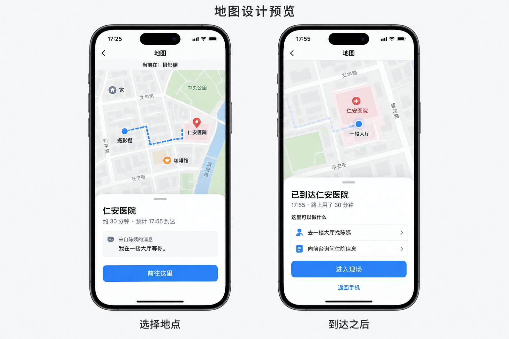

# 地图界面预览 · 2026-10-10

用户要求：先收口消息发送失败提示；地图用图片展示预期，克制、接近真实手机应用。图已在当前对话中展示，尚未收到用户视觉验收。对应任务 MAP-PREVIEW-01；SPACE-02A/02B 仍是实现任务，不能因这张预览图标完成。

## 预览的含义

- 左屏：当前在摄影棚，选择已知的医院，查看消息来源、预计路程和到达时刻，再决定是否前往。
- 右屏：到达医院后，显示已经过去的故事时间，以及有依据的可做事项，例如去大厅找约好的人、向前台询问。选择具体行动后才进入相应现场，不能仅打开地图就算去了某处。
- 返回手机仅切换视图，不改变身体位置，也不默认离开医院。当前位置、日程、任务和人物反馈必须读同一套世界状态。
- 图中摄影棚、医院、人物和街道均为设计示例，没有来自实际玩家记录。30分钟是例子，不是所有路程固定耗时；17:25→17:55只演示一次合法移动后的时间变化。
- 地图只呈现玩家已知地点和消息来源；人物说自己在大厅不等于全知定位。不能显示未知 NPC 实时轨迹或剧透幕后状态。
- 首版可基于虚构世界已知地点图实现。若采用街区地图外观，示意布局必须与实际地点及通行关系一致；不得把本图的虚构道路当真实地理坐标或定位服务。

## 尚待实现

稳定地点与当前位置、合法移动、合理耗时、到达环境与行动、人物的有来源反馈及日程冲突。当前打开已有现场不等于完成物理移动。旧世界缺地点时保留诚实空态，不摆无用图标。

## 生成记录

使用内置 imagegen，单次生成，两屏设计预览。不是生产图像生成服务的验收。图已人工查看：整体层级、字数、时间与场景衔接可用于讨论；最终手机样式和可点击行为须以实际实现与双端验证为准。

提示词要点：普通 iPhone 地图风格、浅色街区与低饱和蓝路线、两屏并排；选择地点显示当前摄影棚/医院/30分钟/17:55/来自陈姨消息，前往；到达屏显示医院/17:55/过去30分钟/找人和前台询问/进入现场/返回手机；不使用霓虹、3D城市、游戏HUD、任务奖励或全知人物定位。完整提示词保留在本对话的生成调用中。
